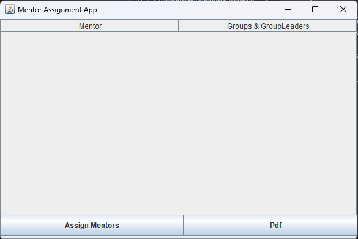
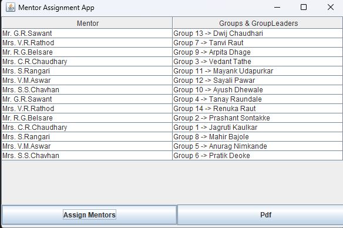

# Mentor Allocation System

A simple Java Swing-based desktop application to manage mentor allocations for students. The application provides a user-friendly interface to input, view, and assign mentors to students.

## 📌 Features

- Add new student records
- Assign mentors to students
- View all allocated mentor-student pairs
- Intuitive GUI built with Java Swing
- Lightweight and easy to use

## 🛠️ Tech Stack

- Java (JDK 8 or higher)
- Java Swing (GUI)
- File-based data storage

## 🖼️ Screenshots

### Main Dashboard  


### Allocation Form  


## 🧑‍💻 How to Run

1. Clone the repository:
   ```bash
   git clone https://github.com/aniketsardar47/Adv.-Java.git
   cd Adv.-Java/Mentor-Allocation
